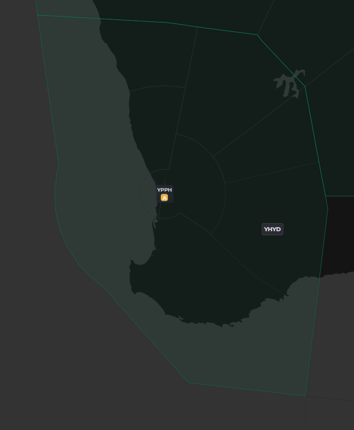
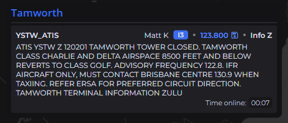
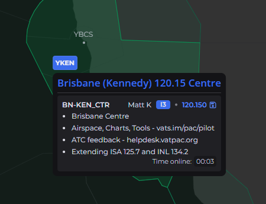

--8<-- "includes/abbreviations.md"

## Background
VATSIM strives to replicate the real world aviation environment as closely as possible. However, the network is a place of learning for both controllers and pilots, and it is unreasonable to expect a 1:1 service.

Pilots should reference real world documents and charts but be prepared for some inconsistencies and discrepancies to exist. The procedures detailed on this site (particularly the [Local Procedures](../local-procedures/)) have been designed to compliment VATPAC's ATC SOPs.

## VATSIM Code of Conduct
A number of policies govern how users of the VATSIM network must conduct themselves. Pilots should be aware of the [Code of Conduct](https://vatsim.net/docs/policy/code-of-conduct){target=new}, which outlines the minimum pilot competency level, connection requirements, and other important information.

!!! warning
    Failure to comply with the Code of Conduct will result in network supervisors taking action against your account, which may include suspension or deletion.

### Restricted Activities
As per the VATSIM [Special Operations Policy](https://vatsim.net/docs/policy/special-operations){target=new}, the following activities are restricted on the VATSIM network. They may only be performed by pilots who are a member of, and flying an operation representing, an approved Virtual Special Operations Association.

- Conducting joint training exercises with other approved VSOAs
- War games
- Air to air refuelling
- Carrier operations
- Flying low level military routes
- Flying escort missions
- Executing air combat manoeuvres
- Interception/scramble of other aircraft
- Having access to special use airspace
- Search and Rescue Operations
- Firefighting Operations
- Launch and Recovery of Space Vehicles
- Air Displays (Flying Displays, Races)
- Fly unmanned aerial vehicles, e.g. Global Hawk

## Radio Communication
As per the VATSIM Code of Conduct, pilots operating OCTA (or without any ATC online) must monitor the appropriate advisory frequency and make radio broadcasts as deemed necessary. In practice, this translates to making all CTAF radio calls on the advisory frequency.

The VATSIM advisory frequency is **122.800**.

Pilots should be aware of the existence of both voice-capable and text-only pilots, and consider making broadcasts via both voice and text where appropriate.

Some pilots may not be using real-world weather or time of day, so pilots should be alert to aircraft using reciprocal or crossing runways, or flying different approaches, at uncontrolled aerodromes.

## Top Down Rule
VATSIM employs a 'top down' rule, whereby controllers may (and in some cases, are expected to) provide a level of coverage to terminal areas and controlled aerodromes within their jurisdiction. This provides a greater service level to pilots but may cause some minor confusion for new members.

Tools like VATSIM Radar and the VATPAC Map display all online controllers. Any major controlled aerodromes which fit inside these sectors can be assumed to have top down coverage, with the overlying controller performing the roles of ADC and SMC/ACD if applicable.

!!! example
    <figure markdown> 
    { width="400" }
    </figure>

    The controller above is logged on as HYD (Melbourne Centre enroute position) which overlays the Perth terminal area and YPPH. Aircraft on the ground at YPPH should contact HYD for airways clearance and all subsequent calls.

Pilots should contact the **lowest** applicable controller as they move up from the aerodrome level to enroute.

!!! example
    **GUN** and **Sydney ADC** are both online. A pilot on the ground at YSSY wishing to obtain airways clearance would contact **SY ADC**, as they are the lowest controller over Sydney.

### Zulu ATISes
A Zulu ATIS (ATIS with code **Z**) may be published by controllers to indicate that an aerodrome which can be temporarily activated is currently **uncontrolled**. Pilots of IFR aircraft should contact the overlying controller prior to taxi to commence their SARWATCH service. Pilots should refer to [Local Procedures](../local-procedures/) to determine whether any special procedures apply to the aerodrome, but may otherwise taxi and depart at their own discretion.

<figure markdown> 
{ width="500" }
<figcaption>A Zulu ATIS for YSTW</figcaption>
</figure>

## Enroute Sector Extensions
Enroute controllers have the option of extending from their primary log on position to other adjacent sectors. When this is the case, they will use an appropriate means to notify surrounding controllers and pilots.

Each controller has a short remark, called a Controller ATIS, associated with their session. The majority of controllers will publish their sector extensions in their Controller ATIS. Mapping tools like VATSIM Radar and the VATPAC Map will automatically display these extended sectors. [Top Down](#top-down-rule) rules apply to any major, controlled aerodromes contained inside an extended sector.

<figure markdown> 
{ width="400" }
<figcaption>KEN extending to ISA and INL</figcaption>
</figure>

!!! warning "Important"
    Some older mapping tools **do not** display extended sectors correctly (or at all). Pilots are *strongly* encouraged to use VATSIM Radar or the VATPAC Map to ensure they have the most up-to-date information at hand, and can comply with their obligations under the VATSIM Code of Conduct at all times.

The sector extension principle is unique to only a handful of divisions worldwide and can be a source of confusion for new or foreign pilots. Expect to be instructed to contact a controller on a frequency which isn't displayed in your pilot client. The use of mapping tools as discussed above can help alleviate this confusion by providing a visual indication of the extend of a controller's jurisdiction.