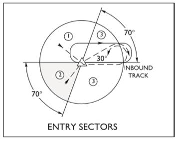

--8<-- "includes/abbreviations.md"

## Background
Holds are flown where a delay of any kind is required. They can be initiated by ATC as part of sequencing actions inbound to a busy aerodrome, or by the pilot where a delayed arrival is beneficial (poor weather, aircraft malfunction, traffic, etc).

## IFR
IFR aircraft should generally hold in a predictable, 'race track' pattern. Rate one turns (or 25° bank angle, if less) should be used at either end and the outbound leg timed to comply with the [holding limitations](#holding-limitations) relevant to the holding position and altitude. To become established in the holding pattern, one of three [sector entries](#sector-entries) shall be flown.

Holding information is found on ERC and TAC charts for enroute and terminal holds. Additionally, most instrument approach procedures and some STARs include published holds. Where a published hold is not available or suitable, pilots may hold at any position (with atc approval in CTA), using the most suitable inbound track, turn direction, and altitude.

### Holding Limitations
Airspeed and outbound timing limitations exist to ensure aircraft remain within a designated proximity to the holding fix. This is important to ensure aircraft remain within the surveyed area applicable to the hold.

| Altitude | Max Outbound Leg Timing | Max Airspeed |
| --- | --- | --- |
| Up to & including FL140 | 1 min | 230 KIAS (or 170 KIAS for Cat A & B procedures) |
| FL140 up to & including FL200 | 1.5 min | 240 KIAS |
| Above FL200 | 1.5 min | 265 KIAS |

!!! note
    ATC may cancel the speed restrictions or approve longer outbound legs when operating in CTA.

In some holding patterns, a DME limit is defined. A turn to the inbound leg must be commenced no later than this DME distance.

### Sector Entries
Designated sector entries allow aircraft to enter a hold without exceeding the limits of the surveyed area. Pilots should assess their current **heading** (not track) and choose the most appropriate sector entry. If the aircraft's heading is within 5° of two sector entries, either may be selected.

The capture regions for each sectory entry are shown in the image below.

<figure markdown> 
  { width="400" }
  <figcaption>Sector Entries & their Capture Regions <small>Source: www.skybrary.aero</small></figcaption>
</figure>

### Sector 1 (Parallel)
From overhead the fix, turn to parallel the outbound track for the appropriate outbound leg time (or until reaching the DME limit), then turn towards, and intercept, the inbound leg.

### Sector 2 (Teardrop)
From overhead the fix, turn to a track 30° offset from the outbound track for the appropriate outbound leg time (or until reaching the DME limit), then turn towards, and intercept, the inbound leg.

### Sector 3 (Direct)
From overhead the fix, commence a turn to the outbound leg.

## VFR
Published holding procedures rarely exist for VFR aircraft. If instructed to hold by ATS, pilots should manoeuvre in a suitable fashion and ensure they do not exceed their clearance limit. This will likely involve conducting orbits or 'race track' patterns.

Helicopters should consider holding in a similar manner, maintaining forward flight to minimise fuel burn. If instructed to hover, this must be complied with.